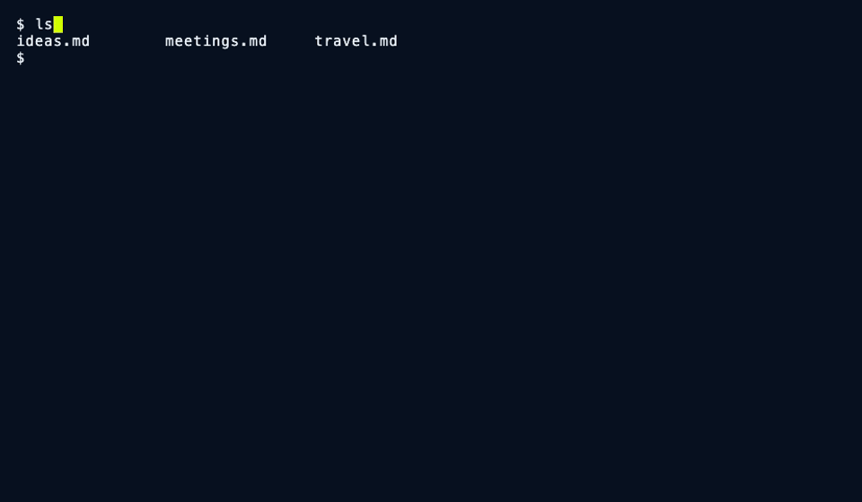

<p align="center">
  
</p>

<p align="center">
  <a href="https://github.com/Dirstral/dir2mcp/actions/workflows/go.yml"></a>
  <a href="https://go.dev/"></a>
  <a href="https://golangci-lint.run/"></a>
  <a href="https://pkg.go.dev/github.com/dirstral/dir2mcp"></a>
  <a href="LICENSE"></a>
</p>

# dir2mcp

Point it at a folder. Ask questions about what is inside, and get answers that
cite the exact file and lines, or the exact seconds of a recording.

dir2mcp indexes a directory (code, Markdown, PDFs and office documents, audio
and video) and serves it over [MCP](https://modelcontextprotocol.io), the
protocol Claude, Cursor and other AI clients use to reach tools and data. It is
one Go binary with its state in `.dir2mcp/` next to your files. It runs fully
local if you want: embeddings and answers can come from Ollama or any
OpenAI-compatible server, and `dir2mcp doctor` verifies that nothing leaves the
machine.

<p align="center">
  
</p>

This is a real run against an Ollama server (`nomic-embed-text` and
`qwen2.5:7b-instruct-q4_K_M`), with no cloud account. `make demo` records it
again from [`assets/demo/demo.tape`](assets/demo/demo.tape).

## Try it in two minutes

```bash
brew tap dirstral/tap
brew install dirstral/tap/dir2mcp   # the full name trusts only this formula
cd ~/notes                      # any folder you want to ask about
```

On Windows, get the zip from Releases instead; see [Windows](docs/install.md#windows) for what
works there and what does not.

**Fully local, no account** (with [Ollama](https://ollama.com)):

```bash
ollama pull nomic-embed-text && ollama pull qwen2.5:7b
dir2mcp up        # the first run asks how to run the models: pick "Locally with Ollama"
```

The setup finds Ollama, lists its models and writes `.dir2mcp.yaml`. To script
it (no terminal), write the same file yourself:

```bash
cat > .dir2mcp.yaml <<'EOF'
providers:
  local:
    kind: openai
    base_url: http://127.0.0.1:11434/v1
    embed_text_model: nomic-embed-text
    embed_code_model: nomic-embed-text
    chat_model: qwen2.5:7b
model:
  embed: {provider: local}
  chat: {provider: local}
EOF
dir2mcp up
```

**Or with one cloud key** (Mistral is the default; OpenAI and Gemini work too):

```bash
export MISTRAL_API_KEY=...
dir2mcp up
```

Then ask from the terminal, or hand the folder to Claude Code, Cursor or
Claude Desktop:

```console
$ dir2mcp ask "When is the budget meeting?"
The quarterly budget meeting is on Thursday. [notes.md:L1-L3]

  Citations
  [1] notes.md  chunk=2 span=L1-L3

$ dir2mcp install claude-code   # Claude Code: start a new session, then ask about the folder
$ dir2mcp install cursor        # Cursor: the server shows in Settings > MCP
$ dir2mcp install claude        # Claude Desktop: restart it, then ask about the folder
```

`dir2mcp status` shows what was indexed, and names every file it skipped with
the reason. `dir2mcp down` stops the server; `up` resumes incrementally.

## What makes it different

- **Answers cite spans, not files.** A citation names a line range for text and
  code, a page for PDFs, and a time range for audio and video. `open_file`
  returns exactly the cited span.
- **Coverage is honest.** A file it could not read, a passage in a language the
  speech model does not cover, or a window of broken transcription is recorded
  with its reason. `dir2mcp status` and `dir2mcp doctor` name it; nothing is
  dropped silently.
- **Any provider, one capability at a time.** Embedding, extraction, speech,
  answers and reranking bind independently, so you can mix providers:

  | Capability | Providers |
  |---|---|
  | Embedding | Mistral, OpenAI, Gemini, any OpenAI-compatible endpoint, self-hosted |
  | Extraction / OCR | docling (local), docling-serve (HTTP), pandoc, Mistral OCR |
  | Transcription | Voxtral, Whisper (self-hosted or OpenAI-compatible) |
  | Answers | Mistral, OpenAI, Anthropic, Gemini, OpenRouter, any OpenAI-compatible endpoint |
  | Reranking | Cohere, ColBERT, self-hosted |

  A provider turns on when its credential is present. There is no separate
  enable flag.
- **Fully local if you want.** docling for extraction, and Ollama, vLLM,
  llama.cpp, LM Studio or TEI for embeddings and answers. `dir2mcp doctor`
  reports whether any configured provider is a third-party host.
- **Media and video.** Transcripts and recognized on-screen events become
  time-anchored, filterable annotations, so an answer can cite a moment and a
  client can play exactly that moment.

## Connect a client

Run these in the folder that `dir2mcp up` serves:

| Client | Command | Then |
|---|---|---|
| Claude Code | `dir2mcp install claude-code` | Start a new session |
| Cursor | `dir2mcp install cursor` | The server shows in Settings > MCP |
| Claude Desktop | `dir2mcp install claude` | Restart Claude Desktop |

Each install replaces only its own entry and keeps your other servers.
`dir2mcp doctor <client>` checks the entry, and `dir2mcp uninstall <client>`
removes it. Details: [connect an MCP client](docs/cli.md#connect-an-mcp-client).

## Install

| Platform | How |
|---|---|
| macOS, Linux (Homebrew) | `brew tap dirstral/tap && brew install dirstral/tap/dir2mcp` |
| With bundled docling | `brew install dirstral/tap/dir2mcp-full` (about 6.3 GB) |
| Nix | `nix run github:dirstral/dir2mcp -- version` |
| Windows | zip from [Releases](https://github.com/dirstral/dir2mcp/releases); read the [Windows limits](docs/install.md#windows) |
| From source | `git clone --recurse-submodules https://github.com/dirstral/dir2mcp && cd dir2mcp && make build` (Go 1.25+) |

[docs/install.md](docs/install.md) has the lean and full tracks, the Nix
service modules and the Windows details.

## MCP tools

| Tool | What it does |
|---|---|
| `dir2mcp_search` | Semantic search over the indexed content |
| `dir2mcp_ask` | Answer a question, with citations |
| `dir2mcp_ask_audio` | Answer with a spoken (TTS) response |
| `dir2mcp_transcribe` | Transcribe an audio file from the corpus |
| `dir2mcp_annotate` | Structured annotation of a document |
| `dir2mcp_transcribe_and_ask` | Transcribe, then answer over the result |
| `dir2mcp_open_file` | Read a file, or exactly the cited span |
| `dir2mcp_open_media_clip` | Cut the audio or video clip for a time span |
| `dir2mcp_related` | Find chunks related to a chunk you already have |
| `dir2mcp_list_files` | List the indexed files with metadata |
| `dir2mcp_stats` | Corpus statistics and the engines in use |

[What a citation carries](docs/mcp-tools.md#what-a-citation-carries) lists
the fields of a time span.

## Configure

The first `dir2mcp up` in a terminal runs a setup wizard and writes
`.dir2mcp.yaml`. `dir2mcp config init` runs it again, and `dir2mcp config
print` shows the settings in force. Keys go in the environment, in
`.env.local`, or in the OS keychain (`dir2mcp config set-secret`), never in the
YAML file.

[docs/configuration.md](docs/configuration.md) is the full reference. It
includes a [fully local, no-egress setup](docs/configuration.md#fully-local--no-egress-setup),
[self-hosted endpoints](docs/configuration.md#self-hosted--gpu-vps-provider-endpoints-embed--ocr--stt),
[document extraction](docs/configuration.md#document-extraction-modes--fallback),
[reranking](docs/configuration.md#reranking-optional), and
[which files are indexed](docs/configuration.md#which-files-are-indexed).

## Common commands

| Command | What it does |
|---|---|
| `dir2mcp up` / `down` | Start the server and index the folder; stop it |
| `dir2mcp status` | What was indexed, and every skipped file with its reason |
| `dir2mcp ask "<question>"` | Ask from the terminal |
| `dir2mcp doctor` | Check the config, the providers and the egress |
| `dir2mcp reindex` | Index everything again |

All commands: [docs/cli.md](docs/cli.md).

## Benchmark

An end-to-end benchmark runs the real binary on a public corpus (120 questions
from SQuAD 2.0, CC BY-SA 4.0) with local models only (`nomic-embed-text` and
`qwen2.5:7b`). On the published run, 75% of the answers contain the gold
answer, 98.7% of the inline citations name the correct file, and dir2mcp
declines 25% of the questions that the corpus cannot answer. Method, raw
results and how to run it again: [bench/README.md](bench/README.md).

## Security

- The server listens on `127.0.0.1` by default, with a bearer token.
- `--public` requires auth unless you also pass `--force-insecure`.
- The server does not index its own config or `.env` files.
- `dir2mcp support-bundle` always removes credentials, so you can attach it to
  a public issue.

[docs/security.md](docs/security.md) has the full defaults. To report a
vulnerability, read [SECURITY.md](SECURITY.md).

## Documentation

Guides in this repo:

- [Install](docs/install.md), [configuration](docs/configuration.md),
  [commands](docs/cli.md), [MCP tools](docs/mcp-tools.md),
  [security](docs/security.md)
- [Tunnels and reverse proxies](docs/deployment.md),
  [dual-machine deployment](docs/dual-machine-deployment.md) (GPU host, corpus
  on NFS or S3), [optional x402 request gating](docs/x402.md)

The normative specification lives in the
[`dirstral-spec`](https://github.com/dirstral/dirstral-spec) submodule:
[SPEC](dirstral-spec/docs/SPEC.md), [VISION](dirstral-spec/docs/VISION.md),
[ECOSYSTEM](dirstral-spec/docs/ECOSYSTEM.md), and the
[compatibility matrix](dirstral-spec/spec/versioning.md).
[`dirstral-conformance`](https://github.com/dirstral/dirstral-conformance) is a
black-box conformance suite for any server that claims the spec, and
[`dirstral-cli`](https://github.com/dirstral/dirstral-cli) is a terminal client.

## Development

```bash
make check        # the full local gate (never rewrites the tree)
make build        # build the dir2mcp binary
make bench-e2e    # run the end-to-end benchmark
make demo         # record assets/demo.gif again
```

Read [CONTRIBUTING.md](CONTRIBUTING.md) before you open a pull request.
Contributor and agent guides: [AGENTS.md](AGENTS.md), [CLAUDE.md](CLAUDE.md).

## License

MIT. See [LICENSE](LICENSE).
